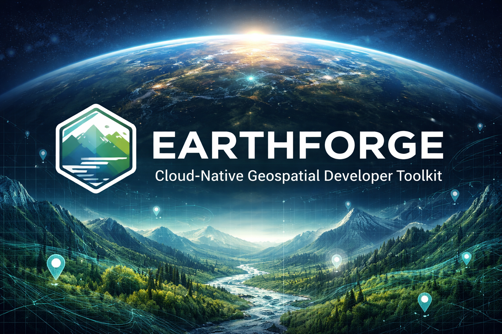
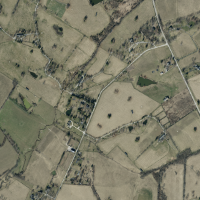

# EarthForge



[](https://www.gnu.org/licenses/gpl-3.0.html)
[](https://www.python.org/downloads/)
[](https://github.com/chrislyonsKY/earthForge/actions)
[](https://pypi.org/project/earthforge/)
[](https://hatch.pypa.io/)

Working with cloud-native geospatial data means juggling `gdalinfo` for COGs, `stac-client` for discovery, `geopandas` for GeoParquet, `xarray` for Zarr, and a collection of one-off scripts to glue them together. Each tool has its own CLI conventions, its own output format, and its own assumptions about how you authenticate to cloud storage.

EarthForge is a single composable toolkit that unifies these workflows. One CLI. One config system. One output contract. Every command works locally, against S3, GCS, or Azure — and every command produces both human-readable tables and machine-parseable JSON.

```bash
# Inspect any cloud-native geospatial file — format auto-detected
earthforge info s3://bucket/image.tif
earthforge info buildings.parquet
earthforge info climate.zarr

# Search STAC catalogs
earthforge stac search sentinel-2-l2a --bbox -85,37,-84,38 --datetime 2025-06/2025-09

# Generate a quicklook preview from a remote COG without downloading it
earthforge raster preview s3://bucket/scene.tif -o preview.png

# Convert legacy formats to cloud-native
earthforge vector convert buildings.shp --to geoparquet
earthforge raster convert image.tif --to cog

# Query GeoParquet with spatial predicate pushdown
earthforge vector query buildings.parquet --bbox -85,37,-84,38

# Inspect and slice Zarr datacubes
earthforge cube info s3://era5-pds/zarr/2025/01/data/air_temperature_at_2_metres.zarr
earthforge cube slice s3://era5-pds/zarr/ --var t2m --bbox -85,37,-84,38 --time 2025-06/2025-06 -o ky_june.zarr

# Pipe structured JSON into other tools
earthforge stac search sentinel-2-l2a -o json | jq '.items[].assets.B04.href'
```

## What EarthForge Is

EarthForge is a **library-first, CLI-first developer toolkit**. Install it as a Python library and call functions directly, or use the CLI from shell scripts and pipelines. Every CLI command is a thin wrapper around a library function, so anything you can do from the terminal you can also do from Python, a Jupyter notebook, or a pipeline runner.

```python
from earthforge.raster.info import inspect_raster
from earthforge.stac.search import search_catalog

# Library usage — same logic as the CLI, no subprocess needed
items = await search_catalog("sentinel-2-l2a", bbox=(-85, 37, -84, 38))
metadata = await inspect_raster("s3://bucket/scene.tif")
```

## Real-World Output

The samples below are actual outputs from EarthForge commands run against public geospatial data. Sample files live in [`data/samples/`](data/samples/).

### KyFromAbove 3-inch Orthoimagery — fetched thumbnail

```bash
earthforge stac fetch \
  https://spved5ihrl.execute-api.us-west-2.amazonaws.com/collections/orthos-phase3/items/N097E305_2024_Season1_3IN_cog \
  --assets thumbnail --output-dir data/kyfromabove_fetch
# → 78,026 bytes in 2.34s
```



*3-inch orthoimagery, KyFromAbove Phase 3 (2024). Public domain. Full COG available at `kyfromabove.s3.us-west-2.amazonaws.com`.*

---

### Sentinel-2 STAC Search — `--output json`

```bash
earthforge stac search sentinel-2-l2a \
  --bbox -85,37,-84,38 --datetime 2025-06/2025-09 --max-items 5 \
  --output json
```

```json
{
  "collection": "sentinel-2-l2a",
  "matched": 47,
  "returned": 5,
  "elapsed_seconds": 1.243,
  "items": [
    {
      "id": "S2A_18SYJ_20250914_0_L2A",
      "datetime": "2025-09-14T16:28:43Z",
      "properties": { "eo:cloud_cover": 4.2, "platform": "sentinel-2a" }
    }
  ]
}
```

Full sample: [`data/samples/stac_search.json`](data/samples/stac_search.json)

---

### COG Metadata — `earthforge raster info`

```bash
earthforge raster info \
  https://sentinel-cogs.s3.us-west-2.amazonaws.com/.../B04.tif \
  --output json
```

```json
{
  "format": "COG",
  "width": 10980, "height": 10980,
  "crs": "EPSG:32618",
  "is_tiled": true, "tile_width": 512, "tile_height": 512,
  "overview_count": 6,
  "compression": "deflate"
}
```

Full sample: [`data/samples/raster_info.json`](data/samples/raster_info.json)

---

### GeoParquet Metadata — `earthforge vector info`

```bash
earthforge vector info ky_wildlife_management_areas.parquet --output json
```

```json
{
  "format": "geoparquet",
  "row_count": 83,
  "geometry_types": ["MultiPolygon"],
  "crs": "EPSG:4326",
  "bbox": [-89.57, 36.49, -81.96, 39.15],
  "compression": "SNAPPY",
  "file_size_bytes": 142863
}
```

Full sample: [`data/samples/vector_info.json`](data/samples/vector_info.json)

---

## What EarthForge Is Not

EarthForge is not a platform. It does not include a web server, a tile cache, a database, an ML pipeline, or a Kubernetes deployment. It is not a replacement for QGIS, ArcGIS, or Google Earth Engine. It does not try to be everything — it is a focused set of tools that integrate with existing workflows via structured output, stdin/stdout piping, and Python imports.

If you need a tile server, use [TiTiler](https://developmentseed.org/titiler/). If you need a STAC API, use [stac-fastapi](https://github.com/stac-utils/stac-fastapi). If you need a geospatial database, use PostGIS. EarthForge is the CLI toolkit you reach for alongside those tools, not instead of them.

## Install

```bash
# Full toolkit
pip install earthforge[all]

# Just what you need
pip install earthforge[stac]        # STAC discovery only
pip install earthforge[raster]      # COG operations only
pip install earthforge[vector]      # GeoParquet operations only
pip install earthforge[cube]        # Zarr datacube operations only
pip install earthforge[cli]         # CLI framework only
```

## Cloud Storage

EarthForge uses named profiles for cloud storage authentication, similar to AWS CLI profiles:

```bash
# Initialize config
earthforge config init

# Search with a specific profile
earthforge stac search sentinel-2-l2a --profile planetary
```

Profiles are defined in `~/.earthforge/config.toml`:

```toml
[profiles.default]
stac_api = "https://earth-search.aws.element84.com/v1"
storage = "s3"

[profiles.planetary]
stac_api = "https://planetarycomputer.microsoft.com/api/stac/v1"
storage = "azure"
```

## Architecture

EarthForge is built as a monorepo with independently installable workspace packages. The architecture is documented in detail — not as an afterthought, but as the foundation the implementation is built on.

- **[ARCHITECTURE.md](ARCHITECTURE.md)** — System design, dependency graph, module interfaces
- **[ai-dev/decisions/](ai-dev/decisions/)** — Architectural decision records with alternatives considered and tradeoffs acknowledged
- **[ai-dev/spec.md](ai-dev/spec.md)** — Requirements and acceptance criteria per milestone

Key architectural decisions:

| Decision | Record | Summary |
|---|---|---|
| Monorepo structure | [DL-001](ai-dev/decisions/DL-001-monorepo.md) | Single repo with Hatch workspace packages, not 15 separate repos |
| Async-first I/O | [DL-002](ai-dev/decisions/DL-002-async-first-io.md) | All network I/O is async via httpx; sync wrappers for convenience |
| obstore for storage | [DL-003](ai-dev/decisions/DL-003-storage-abstraction.md) | Rust-backed S3/GCS/Azure abstraction over fsspec |
| Rust extension boundary | [DL-005](ai-dev/decisions/DL-005-rust-boundary.md) | Rust for format detection and range reads; Python for everything else |
| Engineering credibility | [DL-006](ai-dev/decisions/DL-006-engineering-credibility.md) | Nothing ships empty; decisions before code; scope boundaries enforced |
| promptfoo evaluation | [DL-007](ai-dev/decisions/DL-007-promptfoo-eval.md) | Agent prompts and guardrails regression-tested in CI via promptfoo |

## Formats

| Format | Support | Operations |
|---|---|---|
| COG (Cloud Optimized GeoTIFF) | Full | info, validate, convert, preview, band math, tile |
| GeoParquet | Full | info, validate, convert, query, clip, tile |
| Zarr | Full | info, validate, convert, slice, stats |
| FlatGeobuf | Read/Write | info, validate, convert |
| COPC (Cloud Optimized Point Cloud) | Info | info |
| STAC (SpatioTemporal Asset Catalog) | Full | search, info, validate, fetch, publish |

## Contributing

See [CONTRIBUTING.md](CONTRIBUTING.md). EarthForge has specific engineering standards — please read the contribution guide before opening a PR.

## License

Apache 2.0. See [LICENSE](LICENSE).
